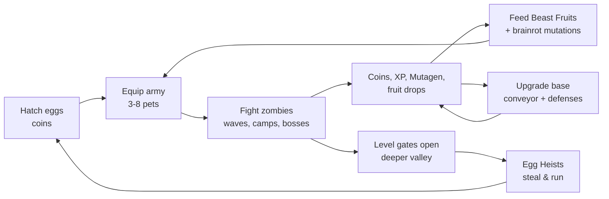
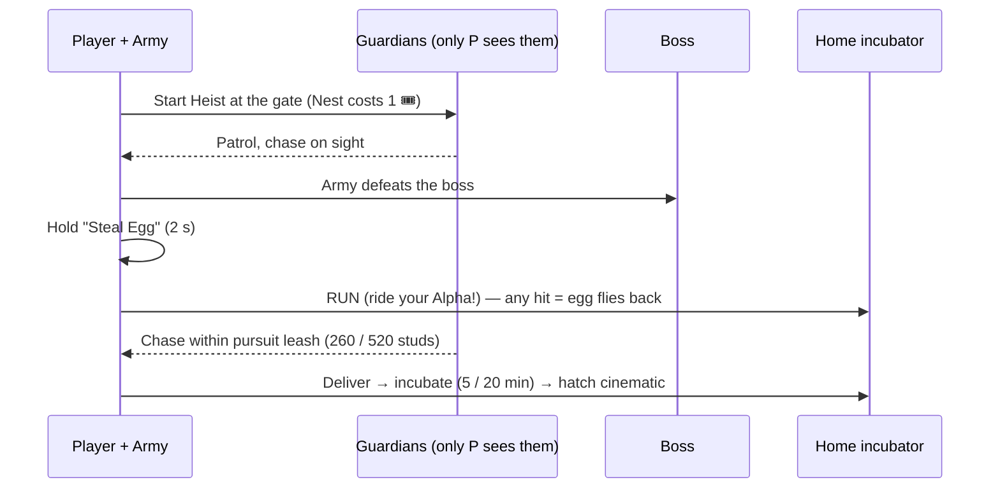
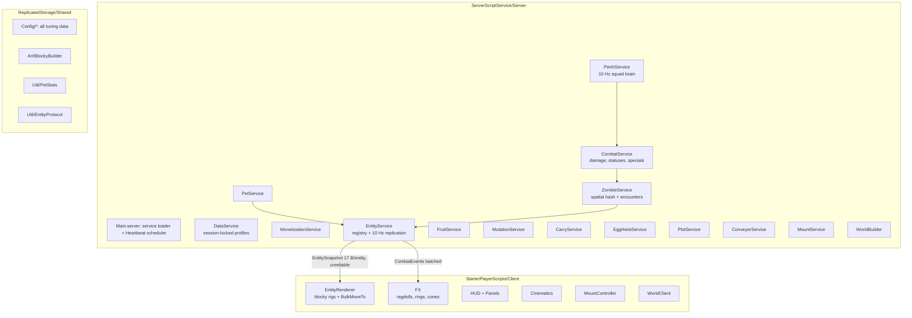

# Beast Valley: Mutant Army & Fruits — Game Design Document

*Formerly "Grow Your Pets — Animal Farm"*

| | |
|---|---|
| **Platform** | Roblox (mobile-first; PC, console, tablet) |
| **Launch** | October 1, 2026 (Early Access), Halloween update Oct 24 |
| **Genre** | Pet collector × Blox Fruits powers × Build-and-Kill zombie defense × conveyor tycoon × steal-it heists |
| **Audience** | 8–16, ~70% phone players |
| **Status** | Playable vertical slice in this repo (`src/`), every system below is implemented unless marked **Roadmap** |
| **Doc owner** | Design (living document: update it in the same PR as the config change) |

---

## 1. Vision

> **Hatch an animal army, feed them Beast Fruits until they mutate into monsters, and send them charging down a giant valley full of zombies, then steal the dragon's egg and run.**

### 1.1 Pillars

1. **Your army, your powers.** You never fight alone. Pets are the heroes. Every Beast Fruit and brainrot mutation changes how a pet *looks and fights*, so what you collect is visible in every battle.
2. **One long valley.** The whole game is one continuous valley you push further into. Every new zone is visible past the next level gate, so there's always a "what's over there?" pull.
3. **Build, then kill.** Your base is both a tycoon (conveyors print money) and a fort (walls and turrets). Zombies attack it, and your army defends it.
4. **Made to be clipped.** Ragdoll zombie explosions, fruit-mutation cinematics, "SIX SEVEN!" crits, server-wide "X STOLE A DRAGON EGG" banners, and a one-tap Clip Mode.

### 1.2 Why this wins (comps)

| Game | What players love | What we take |
|---|---|---|
| **Steal An Egg** (#1 on Roblox this week, ~1.9M CCU on Sep 25, 2026) | Raid a guarded nest, sprint home with the egg, hatch it | **Egg Heists** + ride your pet to escape |
| **Blox Fruits** | Rare fruits = new powers, fruit notifier, mastery | **Beast Fruits** fed to *pets*, mastery unlocks moves |
| **Pet Simulator 99** | Eggs, rarity chase, Golden/Rainbow crafting, server boosts | Eggs, variants, crafting, **Server Luck** |
| **Steal a Brainrot** | Meme characters on a conveyor, stealing from bases | **Brainrot Belt**, mutation capsules, vault stealing |
| **Grow a Garden** | Calm tycoon loop, offline income, weather/events | Conveyor tycoon, offline earnings, live events |
| Zombie games / tower defense | Hordes, waves, satisfying kills | **Build & Kill** waves, ragdoll pops |

**The one-line USP:** it's the only game where your *pets* eat devil-fruit-style powers and fight as a team.

### 1.3 A note on "recognisable"

Every character, fruit, meme and building is **original** and built from studded blocks in code. The game echoes formats players already love (eggs, fruits, heists, brainrot belts) but copies no other game's art, names or uploaded assets. Meme names are parodies of *slang* (Sigma, Aura, Six Seven, Ohio). They never use creator-owned characters (e.g. no Skibidi, no Italian-brainrot character names) because those carry takedown risk.

---

## 2. Core loops



| Loop | Length | What happens |
|---|---|---|
| **Moment** | 5–30 s | Army auto-fights; you tap a zombie to focus-fire, ride your Alpha, pop abilities; zombies explode into blocks |
| **Session** | 15–40 min | Clear a few base waves, grind a valley camp, hatch eggs, feed a fruit, try a heist, buy capsules off the Brainrot Belt |
| **Daily** | 1–2 visits | Day-streak reward, 3 daily quests, free Heist Ticket every 4 h, offline conveyor earnings, fruit dealer restock (hourly) |
| **Weekly** | Update day | New meme mutation capsule, new fruit or egg, limited event, code drop |

### 2.1 First 10 minutes (FTUE)

| Minute | Beat | Built in |
|---|---|---|
| 0:00 | Spawn **on your own farm**. A Farm Pup already follows you | Starter pet in `DataService` |
| 0:30 | Daily reward panel pops, claim day 1 | `HUD` opens `Daily` |
| 1:00 | Big green **🧟 START WAVE** button on your farm. 6 walkers; the Pup + your 300 coins teach combat | `PlotService` button, wave 1 = 6 zombies |
| 2:00 | Walk to the hub (farms line the road), hatch a Farm Egg (250) | Egg stands with odds panel |
| 4:00 | Buy Dropper #2 (750) — goo slides down your belt, coins tick up | `ConveyorService` |
| 6:00 | A server banner: *"A Beast Fruit spawned in Meadow Fields!"* → first trip into the valley | `FruitService` |
| 8:00 | Feed the fruit → slow-mo mutation cinematic | `Cinematics.Mutation` |
| 10:00 | Wave 5 boss (Farmer Zed) is a wall → build a Hay Wall, hatch more | Balance sim in `tests/` |

---

## 3. Progression

### 3.1 Player level & the valley gates

`XP to next level = 60 · L^1.55` (Lv 10 → 2,130 XP; Lv 50 → 25,700 XP). XP comes from kills, waves (20 × wave), hatches (+5), heists (30 × heist level).

| Zone | Z range | Unlock | Mobs (level) | Signature content |
|---|---|---|---|---|
| Barnyard Plaza (hub) | −64 → 280 | Lv 1 | — | Egg stands, Fruit Dealer, Brainrot Belt, Mutation Lab, Evolve statue, golden Griffin fountain |
| Farm Row | 280 → 820 | Lv 1 | — | 8 player bases along the road |
| Meadow Fields | 820 → 1300 | Lv 1 | Walker, Runner (1–8) | Hay Tower parkour, **Chicken Coop Heist**, ponds, flowers |
| Whispering Woods | 1300 → 1850 | **Lv 10** | Walker, Runner, Spitter (10–22) | Pine forest, Treetop Trail, **The Hollow Stump dungeon** |
| Crystal Canyon | 1850 → 2400 | **Lv 25** | Runner, Spitter, Brute (25–40) | Narrow canyon, neon Crystal Spire parkour |
| Volcano Ridge | 2400 → 2900 | **Lv 40** | Brute, Spitter, Runner (40–60) | Stepped volcano (secret fruit in the crater), lava pools |
| Dragon's Nest | 2900 → 3200 | **Lv 50** | Nest Wyverns (55) | **Dragon Egg Heist**, Nest Mother |

Gates are glowing barriers across the valley; the client lets you through once you hit the level, and the server teleports back anyone who skips ahead (`ZoneService`).

### 3.2 Pet growth

| Axis | Rule | Source |
|---|---|---|
| Pet level | `+4.5%` power/HP per level; `XP = 25 · L^1.45`; cap by rarity | Kills (killer 100%, squadmates 50%) |
| Rarity | Stat multiplier 1× → 11× | Eggs, heists |
| Variant | Shiny ×1.5 (1/250 on hatch), Golden ×1.6 (craft 5), Rainbow ×2.6 (craft 5 Golden) | Hatching, crafting |
| Beast Fruit | Stat mods + passive + 2 abilities + awakening | World spawns, dealer, bosses, dungeon |
| Fruit Mastery | +1 per kill (+10 per boss). Ability 2 at **150**, **Awakening at 500** | Fighting with that pet |
| Brainrot Mutations | Joke-named stat perks; 1 slot, 2nd slot at pet Lv 15 | Extractor, Brainrot Belt, stealing |

### 3.3 Base, waves, rebirth

* **Waves:** `count = 4 + 2·wave` (cap 60), zombie level `⌊1.5·wave⌋`, Farmer Zed every 5th wave, Brainrot Titan every 10th. Reward `60·wave^1.35` coins + `3·wave` Mutagen + `20·wave` XP. Waves chain automatically with a 25 s break while you stand on your farm.
* **Evolve Farm (rebirth):** costs `1M × 3^n` coins, resets coins + conveyor, keeps everything else. +25% coins forever; rebirths 1, 3 and 6 add a pet slot.
* **Equip slots:** 3 base → 8 max (+1 pass, +1 VIP, +3 from rebirths).

### 3.4 Retention systems

| System | Rule |
|---|---|
| 7-day streak | 500 coins → 50 Mutagen → 2.5K coins → Heist Ticket → 10K coins + 150 Mutagen → Rare capsule → Fruit + Ticket; loops; resets if you miss a day |
| Daily quests | 3 of 7 (kill 150, clear 5 waves, hatch 10, 2 bosses, 1 fruit, 1 heist, 1 steal) |
| Free Heist Ticket | +1 every 4 h, stockpiles to 2 (VIP +2/day) |
| Offline earnings | 50% of conveyor rate for up to 2 h (8 h VIP) |
| Fruit Dealer | Hourly restock |
| Zone bosses | Every 10 min per zone, announced server-wide |

---

## 4. Pets

### 4.1 Rarity tiers

| Tier | Colour | Stat × | Max Lv | Size × | Sell | Announce |
|---|---|---|---|---|---|---|
| Common | grey | 1.0 | 25 | 1.0 | 10 | — |
| Uncommon | green | 1.35 | 30 | 1.0 | 40 | — |
| Rare | blue | 1.9 | 40 | 1.05 | 200 | — |
| Epic | purple | 2.8 | 50 | 1.1 | 1.2K | — |
| Legendary | gold | 4.2 | 60 | 1.2 | 8K | server |
| Mythical | pink-red | 6.5 | 75 | 1.3 | 50K | server |
| **Secret** | rainbow on black | 11 | 100 | 1.4 | 500K | **every server** |
| Exclusive | pale gold | 7.5 | 80 | 1.3 | — | server |

### 4.2 Roles: why the army fights as a team

| Role | AI behaviour | Perk |
|---|---|---|
| **Tank** | Targets the zombie closest to *you*; taunts everything within 14 studs every 6 s | Takes 20% less damage |
| **Striker** | Hunts the weakest zombie (finishing blows) | +10% crit |
| **Ranged** | Kites at 85% of range, fires projectiles | Long reach |
| **Support** | Stays near you, heals squad 6% every 4 s | — |

### 4.3 Roster (25 at launch)

| Rarity | Pets (role) |
|---|---|
| Common | Farm Pup (Striker), Barn Kitty (Striker), Chick (Ranged), Piglet (Tank), Bunny (Support) |
| Uncommon | Moo Cow (Tank), Grumpy Goat (Striker), Pond Duck (Ranged), Fluffy Sheep (Support) |
| Rare | Valley Fox (Striker), Grey Wolf (Striker), Night Owl (Ranged), Wild Boar (Tank) |
| Epic | Grizzly (Tank), Spirit Stag (Support), Shadow Panther (Striker) |
| Legendary | Blaze Tiger (Striker), Iron Rhino (Tank), Storm Eagle (Ranged) |
| Mythical | Royal Griffin (Striker), Phoenix Chick (Ranged), Starlight Unicorn (Support) |
| Secret | **Sigma Capybara** (Tank, wears shades) |
| Exclusive | Golden Alpha Wolf (VIP monthly), Pumpkin Hound (Halloween) |

### 4.4 Eggs (odds are shown in-game before every hatch)

| Egg | Price | Odds |
|---|---|---|
| Farm Egg | 250 | Pup 28 · Kitty 28 · Chick 20 · Piglet 14 · Bunny 8 · Cow 1.9 · Fox 0.1 |
| Meadow Egg | 3K | Cow 30 · Goat 28 · Duck 22 · Sheep 15 · Fox 4 · Owl 0.9 · Bear 0.1 |
| Woods Egg (Lv 10) | 40K | Fox 32 · Wolf 30 · Owl 22 · Boar 12 · Bear 3.5 · Stag 0.45 · Tiger 0.05 |
| Crystal Egg (Lv 25) | 600K | Bear 35 · Stag 30 · Panther 25 · Rhino 8 · Tiger 1.9 · Eagle 0.1 |
| Golden Coop Egg (heist) | 5 min incubation | Panther 40 · Tiger 30 · Eagle 20 · Rhino 9 · Griffin 1 |
| Dragon Egg (heist) | 20 min incubation | Griffin 50 · Phoenix 32 · Unicorn 17.5 · **Sigma Capybara 0.5** |

**Luck** (Lucky Hatch pass ×1.5, Server Luck ×2) multiplies every entry under 5% odds, then renormalises. The egg panel shows the adjusted table live.

---

## 5. Beast Fruits (the Blox Fruits mechanic)

Fruits are **fed to a pet**, not eaten by the player. One fruit per pet; a new fruit replaces the old one. Feeding plays an in-world slow-motion orbit cinematic while the pet rebuilds with its mutated body.

**Getting fruits:** world spawns (every 6 min, max 4 on the map, 15 min lifetime, some on hidden parkour tops), boss drops (8–35%), dungeon chests (25%), Fruit Dealer (15K coins, hourly), Robux roll (odds shown, region-gated), codes. Storage: 5 (+10 with pass).

### 5.1 The 5 starter fruits

| | 🔥 **Blaze** | ❄️ **Frost** | ⚡ **Volt** | 🐉 **Dragon** | 🌀 **Ohio** |
|---|---|---|---|---|---|
| Type | Elemental | Elemental | Elemental | **Beast** | **Meme / Brainrot** |
| Rarity | Rare | Rare | Epic | Legendary | Mythical |
| Stat mods | Power ×1.3, Speed ×1.05 | Power ×1.15, HP ×1.2 | Power ×1.25, Rate ×1.25, Speed ×1.2 | Power ×1.45, HP ×1.5, Speed ×1.1 | Power ×1.55, HP ×1.2, Speed ×1.15, Rate ×1.1 |
| Passive (every hit) | Burn 30%/s for 3 s | Chill −35% speed | 25%: chain to 2 more | Burn + 30% splash | **6.7% chance: 6.7× "OHIO CRIT"** |
| Ability 1 (M0) | **Flame Pounce**: dash + fire AoE ×3 | **Glacier Howl**: 55° cone, freeze 2.5 s | **Chain Zap**: 6 jumps ×3, shock | **Dragon Breath**: 50° cone ×4 + burn | **Only In Ohio**: random meme (below) |
| Ability 2 (M150) | **Inferno Ring**: r20 ×6 | **Blizzard**: r22 ×4, freeze 3 s | **Thunder Stomp**: r18 ×5, stun | **Sky Dive**: leap to densest cluster, r16 ×7, launches zombies | **Aura Farm**: r26 ×8, "+1000 AURA" |
| Awakening (M500) | Power ×1.25 | HP ×1.3 | Rate ×1.25 | Power ×1.2, HP ×1.2 | Power ×1.3, Speed ×1.2 |
| Visual mutation | Orange-red recolour, neon flame mane + ember tail, fire aura | Ice-blue, crystal spikes down the back, frost aura | Yellow, neon lightning bolts, sparks | **Dragon-beast:** crimson body, bat wings, horns, spiked tail, ×1.25 size | Magenta/cyan glitch palette, rainbow cycling, orbiting glitch halo |
| World spawn / Robux roll odds | 34% / 30% | 34% / 30% | 20% / 24% | 10% / 13% | 2% / 3% |

**Only In Ohio** rolls one of: *Gravity Flip* (launch every zombie 22 studs up, ×5), *bruh.* (freeze all 3 s), *Confetti Nuke* (×7 with confetti ragdolls) or *GIGA MODE* (the pet grows 2.5× and deals 2× damage for 8 s).

### 5.2 Roadmap fruits (data-only additions)
Magma (Elemental), Shadow (Elemental), Kong (Beast), Phoenix (Beast, revive), **Sixty-Seven** (Meme), **Aura Farmer** (Meme). Adding one is a `Config/Fruits.luau` entry plus optional `BlockyBuilder` accessory parts. Abilities reuse the five generic kinds (Burst, Cone, Chain, Dash, Meme).

---

## 6. The Animal Army & Build-and-Kill defense

### 6.1 Squad commands (bottom of the HUD)

| Command | Behaviour |
|---|---|
| 👣 **Follow** | V formation behind you (Alpha at your right hand); engage within 38 studs |
| ⚔️ **Attack** / tap a zombie | Every pet focuses that target, then returns to Follow |
| 🛡️ **Guard** | Ring around your Barn Heart; defends the base even when you leave |
| 🏹 **Hunt** | Aggressive 90-stud radius, long leash, for grinding camps |

Pets surround targets from different angles, spread across targets (a "pressure" score), faint instead of dying (8 s), and catch thieves carrying your loot.

### 6.2 Zombies

| Zombie | HP / Dmg (Lv1) | Notes |
|---|---|---|
| Walker | 28 / 3.5 | Shambles |
| Runner | 20 / 3 | 17 speed |
| Brute | 140 / 10 | 1.6× size |
| Spitter | 26 / 4 | Ranged 20 |
| **Farmer Zed** (boss) | 600 / 14 | Straw hat; every 5th wave, Meadow/Woods zone boss |
| **Brainrot Titan** (boss) | 2,600 / 30 | Neon crown; every 10th wave, Canyon/Volcano boss |
| Coop Guard / Giant Rooster | 120 / 9 · 900 / 18 | Chicken Coop heist |
| Nest Wyvern / **Nest Mother** | 150 / 40 · 4,000 / 90 | Dragon's Nest heist |

Growth per level: HP ×1.08, damage ×1.06, coins ×1.12. That's tuned so a zone stays a fight but never a wall (see `tests/logic.spec.luau` balance sim: a fresh 2-pet squad clears wave 1 in ~7 s; a Lv50 Dragon-fruit Griffin army beats the Nest Mother in ~45 s).

### 6.3 Base defenses (6 build pads)

| Tier | Cost | HP | Effect |
|---|---|---|---|
| Hay Wall | 400 | 250 | Blocks the path |
| Spike Wall | 3K | 600 | Blocks + thorns |
| Fruit Turret | 25K | 500 | 34 range, 30 dmg ×1.2/s (scales with wave) |
| Blaze Cannon | 250K | 900 | 40 range, 150 dmg splash + burn |

Broken defenses and the Barn Heart (600 HP) fully repair between waves; a failed wave costs nothing but your streak.

### 6.4 Mounts
Your **Alpha** pet is your mount (**RIDE** button, `R`, or gamepad Y). Speed `28 + pet speed × 0.6` (Turbo Mount ×1.3), higher jump, the rider plays the Roblox sit pose. **Mounted combat:** ⚔️ / left click / R2 swings a wide 120° arc (range = pet range + 9) at 1.3× the pet's power, with its fruit passive. Riding is the heist escape plan.

---

## 7. The Long Valley (world design)

```
 z=-64      280        820        1300        1850       2400        2900     3200
  | HUB     | FARM ROW | MEADOW   | WOODS     | CANYON   | VOLCANO   | NEST   |
  | eggs    | 8 bases  | Lv1      | Lv10 gate | Lv25     | Lv40      | Lv50   |
  | dealer  | road     | coop     | hollow    | crystal  | volcano   | dragon |
  | belt    |          | heist    | stump     | spire    | crater    | egg    |
  ---------- straight --------------- meandering valley (±80 studs) --------------
            cliffs 46-100 studs tall on both sides, road down the middle
```

* **Built from studs in code** (`WorldBuilder`): meandering block terrain with 1-stud steps, two-layer cliffs with grassy tops, a dirt road down the centre so phone players always know which way is "further", biome palettes, trees (round, pine, crystal, dead), rocks, flowers, ponds, lava.
* **Secrets & parkour:** Hay Tower spiral (Meadow), Treetop Trail (Woods), Crystal Spire (Canyon), volcano crater (Volcano). Each top holds a **hidden fruit spawn** that shows no label.
* **Secret dungeon:** *The Hollow Stump* (Woods): enter, get teleported to an underground arena, survive 4 waves + Farmer Zed, win coins/Mutagen with a 25% fruit and 50% capsule chance. 5 min cooldown.
* **Zombie camps:** 31 camps (6–9 zombies each) that only simulate when a player is within 320 studs and refill 15 s after you stop killing.

---

## 8. Egg Heists ("Steal an Egg")



| Site | Entry | Guards | Boss | Egg |
|---|---|---|---|---|
| Chicken Coop (Meadow) | Free, 10 min cooldown | 4 Coop Guards (Lv8) | Giant Rooster | Golden Coop Egg |
| Dragon's Nest (end of valley) | 1 Heist Ticket | 5 Nest Wyverns (Lv55) | Nest Mother | Dragon Egg |

Guardians are **per-player instanced** (only the runner sees and fights them), so heists never grief other players. Incubator: 3 slots (+1 VIP); Gems can finish incubation instantly (deterministic, not random).

---

## 9. Tycoon & Brainrot conveyor

### 9.1 Conveyor (your farm's money printer)

| Dropper | Price | Value / drop (2 s) | Mutagen |
|---|---|---|---|
| 1 | free | 5 | 0.05 |
| 2 | 750 | 8 | 0.1 |
| 3 | 6K | 25 | 0.25 |
| 4 | 50K | 90 | 0.6 |
| 5 | 400K | 350 | 1.5 |
| 6 | 3M | 1,400 | 4 |

Each dropper upgrades (+35% per level, cost `150·tier^2.2 · 1.6^level`). Belt tiers ×1 / ×1.35 / ×1.8 / ×2.5 (2x Conveyor pass doubles on top). Income is credited once per second from a formula; the goo you see sliding down the belt is drawn by each client from the same numbers, which costs zero network.

### 9.2 Brainrot mutations (12 at launch, rotated weekly)

| Mutation | Rarity | Joke | Real effect |
|---|---|---|---|
| 🗿 Mewing Jawline | Uncommon | "Jaw so sharp it crits." | +15% crit |
| 🤖 NPC Mode | Uncommon | "Hello traveler." | +40% HP, grey tint |
| 🌱 Touch Grass | Uncommon | "Went outside. Came back healed." | Regen 3%/s out of combat |
| 😎 Sigma Stare | Rare | "Doesn't blink." | ×1.5 damage to bosses, shades |
| 🐜 Tiny Menace | Rare | "Small. Fast. Unhinged." | ×0.55 size, +25% rate, +12% dodge |
| ☕ Espresso Overload | Rare | "Seventeen shots." | +60% attack rate, jitters |
| 💖 Rizz Aura | Epic | "Zombies stop to stare." | 10% on hit: stun + take +50% damage |
| 🐘 Absolute Unit | Epic | "In awe at the size of this lad." | ×1.8 size, +80% HP, +15% power |
| 📶 Lag Spike | Epic | "Hits register twice." | Every hit repeats 0.4 s later |
| 🤲 **Six Seven** | Legendary | "Every 67th hit does 67× damage." | Exactly that |
| 🌟 Main Character | Legendary | "The plot armor is real." | Taunts, −40% damage taken, spotlight |
| ✨ +1000 Aura | Mythical | "Aura is damage." | +2% damage per kill, stacks to 50 |

**Sources:** the **Brainrot Extractor** on your conveyor (a capsule every 180/120/75 s by tier), the hub **Brainrot Belt** (capsules roll past with price tags; first to buy wins), dungeon/daily/code rewards, and **stealing**. Applying costs Mutagen (25 → 25K by rarity).

### 9.3 Stealing (steal-a-brainrot)

* Capsules sit on pedestals in your vault. Visitors can hold **Steal** (1.6 s) if your base is unlocked.
* The thief carries it overhead with a red label (visible to everyone) at 80% speed and must reach **their own farm**.
* **Your pets hunt thieves**: any pet within 55 studs chases, and touching the thief returns the capsule. So does a zombie hit, a death, leaving, or 2 minutes passing.
* **Lock Base**: 60 s (90 s VIP), 90 s recharge.
* **New-player shield:** nobody can rob you during your first 20 minutes in the game.

---

## 10. Economy

| Currency | Earned from | Spent on | Sold for Robux? |
|---|---|---|---|
| 💰 Coins | Kills, waves, conveyor, offline, codes, dailies | Eggs, droppers, belts, defenses, Brainrot Belt, Fruit Dealer, rebirth | **Never** (this keeps coin eggs out of paid-random-item rules) |
| 🧪 Mutagen | Conveyor, kills, waves, dungeon | Applying mutations | No |
| 💎 Gems | Robux packs, future events | Deterministic items only: skip incubation, repair heart, vault slots, cosmetics | Yes |

---

## 11. Monetization

### 11.1 Game passes

| Pass | Price | Why people buy it |
|---|---|---|
| 👑 VIP (lifetime) | 499 | All VIP perks, for players who can't subscribe |
| 🔔 Fruit Notifier | 449 | Everyone sees "a fruit spawned somewhere!"; owners get the exact fruit, a sky beam and distance |
| ⏩ 2x Conveyor Speed | 249 | Doubles base income forever |
| ➕ +1 Pet Equip | 199 | Bigger army, bigger power spike |
| 🍀 Lucky Hatch | 399 | ×1.5 on every <5% pet (**paid-random: region-gated, odds shown**) |
| 🥚 Triple Hatch | 349 | Hatch 3 at once (+ auto hatch) |
| 🏇 Turbo Mount | 179 | +30% ride speed, the heist escape |
| 🧺 +10 Fruit Storage | 149 | Hoarders |

### 11.2 Developer products

| Product | Price | Notes |
|---|---|---|
| ☢️ **Zombie Nuke** | 99 | Kills your wave + everything within 220 studs in a giant ragdoll explosion; server banner. The most clippable purchase in the game |
| 🎟️ Heist Ticket ×1 / ×5 | 49 / 199 | Paid-random (leads to egg roll): odds shown, region-gated |
| 🎲 Beast Fruit Roll | 99 | Odds shown, region-gated |
| 🌟 Server Luck ×2 (15 min) | 149 | Boosts **everyone** in the server and announces the buyer by name (social flex) |
| 💎 Gems 100 / 550 / 1,400 | 80 / 400 / 950 | Bulk bonus |

### 11.3 VIP subscription — "Beast Valley VIP", $4.99/month
+1 pet slot · ×1.5 coins · 2 Heist Tickets/day · 8 h offline earnings · +2 vault slots & longer base lock · +1 incubator · monthly exclusive **Golden Alpha Wolf** · VIP chat tag. Uses Roblox Experience Subscriptions (`MarketplaceService:PromptSubscriptionPurchase`); falls back to the lifetime pass until the subscription ID is configured.

### 11.4 Compliance & fair play (non-negotiable)
* Roblox's **paid random items** policy: every Robux path to a random outcome (fruit roll, heist tickets, luck boosts, server luck) shows exact odds **before** purchase and is hidden/refused when `PolicyService:GetPolicyInfoForPlayerAsync(...).ArePaidRandomItemsRestricted` is true (fails closed in live servers).
* Coins are never sold, so coin-bought eggs aren't paid random items.
* Receipts are idempotent (last 100 receipt IDs stored in the profile).
* Everything purchasable is also earnable at a slower pace, except convenience passes. No pay-only pets except the VIP monthly exclusive.
* Audience is kids: no loot-box pressure pop-ups on join, no fake countdown timers, no gambling language. The only automatic pop-up is the daily reward.

---

## 12. Virality & launch strategy

### 12.1 Built-in clip moments
| Moment | Why it travels |
|---|---|
| **Zombie ragdoll pop**: every kill bursts into physics blocks, and Fire/Ice/Dragon/Confetti variants each die differently | Satisfying loop, perfect for 7-second Shorts |
| **Mutation cinematic**: camera orbits your pet in slow-mo, flash, giant title (*"🐉 DRAGON MUTATION!"*) | Transformation reveals are the #1 pet-game clip |
| **Meme text**: *"6.7x OHIO CRIT"*, *"🤲 SIX SEVEN!!"*, *"💀 bruh."*, *"✨ +1000 AURA"*, *"🗿 GIGA MODE"* | Recognisable slang = instant comment bait |
| **Server banners**: *"🥚 Ruhan stole a DRAGON EGG and made it home!"* (cross-server for Secret hatches & Dragon Eggs) | Social proof + FOMO |
| **Zombie Nuke / Server Luck** | Buyer is named in the banner, so other players see them |
| **🎬 Clip Mode** | One tap hides all UI for clean vertical recording |
| **Heist escapes**: riding a mutated dragon-cat down the valley with guardians chasing | Chase footage |

### 12.2 Launch plan (today is Sep 25 → Oct 1)

| Date | Work |
|---|---|
| Sep 25–26 | Create passes/products/subscription in Creator Hub, paste IDs into `Config/Monetization.luau`; enable Studio API access; playtest with 4–8 people on phones |
| Sep 27 | Tune waves 1–10 and first-hour coin curve from playtest; thumbnail + icon (dragon-cat mid-mutation, zombie explosion behind, "STEAL THE DRAGON EGG") |
| Sep 28 | Record 10 Shorts from Clip Mode (mutation reveals, nuke, heist escape, SIX SEVEN crit) and seed them to 5–10 small creators with private codes |
| Sep 29–30 | Soft launch (friends/Discord), fix crashes, set `RELEASE` code live |
| **Oct 1** | Public Early Access. Post the Shorts. Update notes promise weekly Saturday updates |
| Oct 4, 11, 18 | Weekly updates: new meme capsule + a new fruit or egg each week |
| **Oct 24–31** | **Halloween: Blood Moon waves**, Pumpkin Hound, Pumpkin Egg, candy currency. Zombie theme + October launch is the whole point |

### 12.3 Live-ops rules
* **Meme rotation:** every Saturday, one new brainrot capsule; the oldest moves to "Classic" rarity. Memes are data (`Config/Mutations.luau`), so this is a 10-minute change.
* **Codes** per creator (track which video drove joins).
* **Invite friends** from the More panel (`SocialService:PromptGameInvite`). **Roadmap:** +10% luck per friend in the server.

---

## 13. UI layout (mobile-first)

```
┌────────────── [💰 12.4K] [🧪 350] [💎 40] [Lv 12 ▓▓▓░] ──────────────┐
│ 🐾 Pets      [🧟 WAVE 7 · 12 left  ❤ Barn Heart ▓▓▓▓░]    📜 QUESTS │
│ 🍉 Fruits    [👹 Farmer Zed · Lv 8 ▓▓▓▓▓▓░░]               ▫ 42/150 │
│ 🧪 Lab       (toasts)                                        ▫ 2/5   │
│ 🛒 Shop      (📣 server banners)                                     │
│ 🎁 Daily                                              [🧟 WAVE]      │
│ ⚙️ More                                               [🐎 RIDE]      │
│          [👣 Follow][⚔️ Attack][🛡️ Guard][🏹 Hunt]    [ ⚔️ ]        │
│   (stick) [🐶▓▓][🐱▓▓][🐷▓▓][🦊▓▓]  ← squad HP cards   (jump) 🎬     │
└──────────────────────────────────────────────────────────────────────┘
```

* Keeps clear of Roblox's chat (top-left), player list (top-right), thumbstick (bottom-left) and jump button (bottom-right).
* One `UIScale` driven by screen height (0.6×–1.2×) so 72-px buttons stay ≥ 43 pt on phones.
* FredokaOne, thick dark outlines, rounded panels, rarity colours as the only saturated card colours. **No uploaded images**: emoji + shapes.
* Panels (one at a time): Pets (grid + detail: equip, Alpha, lock, craft, sell, stats, abilities, mutations), Fruits (feed), Lab (apply capsule), Shop (VIP, passes, products **with odds**, gems, codes), Egg (live odds with luck, Hatch ×1/×3/Auto), Dealer, Evolve, Daily, Quests, More (Clip Mode, invite).

---

## 14. Art direction & performance ("stud texture pack")

| Rule | Implementation |
|---|---|
| Classic studs | Engine `SurfaceType.Studs` on Plastic tops (no texture memory), `Inlet` bottoms |
| Materials | Plastic, SmoothPlastic, Neon for glow only. **No** SurfaceAppearance, PBR MaterialVariants, 4K textures, meshes or decals |
| Creatures | 15–46 SmoothPlastic blocks each (measured in tests), built by `BlockyBuilder`, client-side only |
| Shadows | Only big terrain casts shadows; props and creatures don't (or only on high quality) |
| Lighting | `Voxel` technology, light Atmosphere haze for valley depth, no Clouds/Bloom/DOF |
| Streaming | `StreamingEnabled`, target radius 512; creatures only exist within 300 studs of the camera; limbs freeze beyond 110 studs; far creatures update every 2nd frame |
| Budgets | Particles, floating text (≤40) and ragdoll debris (≤260 parts) scale with graphics quality; phones are capped at medium |
| Palettes | Per-zone ground / alt-row / cliff / cliff-top / accent (see `Config/World.luau`); alternating row colours give the mowed-lawn look |

---

## 15. Technical architecture

### 15.1 Overview



**Key decision: entities are server-simulated tables and client-rendered blocks.** No Humanoids, no physics, no server-side parts for pets or zombies. The server runs every pet and zombie at 10 Hz and sends each player a binary snapshot of what's near them (`u16 id, f32 x/y/z, u8 yaw, u8 state, u8 hp` = 17 bytes; 48 entities = 817 bytes per packet). Clients build rigs from shared config, smooth toward snapshots, pose limbs procedurally, and move every part with one `workspace:BulkMoveTo` per frame. That's how a phone draws 60 zombies and a full army.

### 15.2 Step-by-step: the Pet AI (`PetAIService.luau`)

1. **Data → entity.** `PetService:SpawnPet` computes stats with shared `PetStats.Compute(pet)` (species × rarity × variant × level × fruit × mutations × global tuning) and registers a `Pet` entity with `EntityService:Create` (position, stats, fruit id, cooldowns, appearance).
2. **One scheduler.** `Main.server.luau` calls `PetAIService:Step(0.1)` every 100 ms (no per-pet scripts or loops).
3. **Squad context** (per player): owner root, feet height, facing, command mode, anchor (owner or Barn Heart in Guard), whether the owner stands on a structure (then pets raycast for floor, e.g. the dungeon), thieves carrying your loot (`CarryService:ThievesFrom`), and a **pressure map** (how many pets already target each zombie).
4. **Separation:** O(n²) push inside the squad (n ≤ 8) so pets never stack.
5. **Per-pet state machine**: Fainted → timer → back; Mounted → glued under the rider; passives (Support heal pulse, Tank taunt, regen, buff expiry); teleport-to-formation if >220 studs away; **thief chase** beats everything; **target** (re)scan every ~0.3 s (staggered by id).
6. **Role-driven scoring** in `ChooseTarget` (Tank: closest to owner; Striker: lowest HP; Ranged: prefers distance; Support: stays near owner; bosses slightly preferred, Sigma Stare strongly; +7 per pet already on that target; focus command = −1000).
7. **Abilities first:** `TryAbility` walks unlocked abilities (highest mastery first); `Cast` runs one of five **generic kinds** (Burst, Cone, Chain, Dash, Meme), each gated by `minTargets` (or a boss) so abilities fire at crowds, not single walkers.
8. **Engage:** melee pets approach their own angle around the target (surround); Ranged pets kite at 85% range; on cooldown `1/attackRate`, `CombatService:PetBasicHit` applies fruit passives + brainrot specials; projectile FX for Ranged.
9. **Formation** when idle: V behind the owner (Alpha at the right hand) or a ring around the core in Guard; catch-up speed scales with distance.
10. **Replication:** `EntityService:Replicate` packs positions/state/hp; combat events go only to players within 260 studs.

### 15.3 Step-by-step: the Fruit Mutation system

1. **Data:** a fruit is one table in `Config/Fruits.luau`: stats, `onHit`, `abilities[]` (kind + numbers + mastery gate), `awaken`, and `look` (palette, tint, aura, extra parts, size).
2. **Acquire:** `FruitService` world spawns (tagged anchors from `WorldBuilder`, notifier beams), `DealerRoll` (coins), `Roll("robux")` from a receipt, `GrantRandom` from bosses/dungeon, codes.
3. **Feed:** client `FeedFruit` → server validates ownership → `pet.fruit = {id, mastery = 0}` → `PetService:RefreshPet`.
4. **Recompute:** `PetStats.Compute` applies fruit stats, awakening, and unlocked abilities (`mastery >= ability.mastery`) → entity stats updated live, HP ratio preserved.
5. **Re-skin:** `EntityService:SetAppearance` sends `{species, variant, fruit, awakened, mutations, scale}`. Every client rebuilds the rig: `BlockyBuilder.Build` lerps the palette toward the fruit palette, bolts on accessory parts (FlameMane, IceSpikes, DragonWings…), sets aura particles/rainbow/halo flags.
6. **Cinematic:** server fires `MutationCinematic`; the owner's camera orbits the real pet in slow-mo with a flash, rings, burst, shake and a giant title (viewport fallback if the pet isn't deployed).
7. **Growth:** each kill → `PetService:AwardKill` → `AddMastery`; crossing 150 unlocks ability 2 and crossing 500 **awakens** (more aura, stat mods, server banner) → back to step 4.
8. **Combat hooks:** `CombatService:PetBasicHit` reads `fruit.onHit` (Burn/Chill/Chain/Splash/SixSeven) every hit; abilities route through `PetAIService:Cast` → `CombatService:Burst/Cone/ChainFrom`.
9. **Brainrot mutations** use the same pipeline: `MutationService:Apply` → `pet.mutations` → `RefreshPet` → accessories (Shades, Jaw, Cup, Hands67…) and `special` flags that `CombatService` reads (crit, boss damage, every-67th-hit, repeat hit, charm, aura stacks, taunt, dodge, regen).

### 15.4 Data & safety
* Profiles: `UpdateAsync` with a session lock (job id + time, 10 min expiry, steal after 3 retries), autosave 120 s, save on leave, `BindToClose` flush, reconcile new fields, in-memory fallback in Studio.
* Every remote validates types; hatching checks distance to the egg stand, cooldown, level, capacity and price server-side; stealing checks lock, protection, carrying state; zone skips are corrected server-side.
* Paid items: see §11.4.

### 15.5 Tooling
* **Rojo** project (`default.project.json`), pinned with `rokit.toml`.
* `./scripts/check.sh`: **luau-lsp** type check against the real Roblox API definitions, the headless logic tests (`tests/`: 21,600 pet-stat combos, 7,210 creature builds, odds sums, protocol round-trip, world geometry, balance sim), and the place build → `build/BeastValley.rbxlx`. CI runs the same script on every push (`.github/workflows/ci.yml`).

---

## 16. Production checklist before Oct 1

- [ ] Create 8 game passes, 8 developer products, 1 subscription in Creator Hub → paste IDs into `src/shared/Config/Monetization.luau` (0 = hidden live / free in Studio)
- [ ] Game Settings → Security → **Enable Studio Access to API Services** (to test saving)
- [ ] Studio playtest with **4+ players** (Test → Clients and Servers) on the phone emulator: waves 1–10, a heist run, a steal, a mount escape
- [ ] Performance pass on a real low-end Android phone (MicroProfiler: target <8 ms server Heartbeat, 30+ FPS client)
- [ ] Add analytics funnels (`AnalyticsService`: first hatch, first fruit, wave 5, first heist) — **Roadmap**
- [ ] Icon, thumbnails, description with codes; set age/content questionnaire (fantasy violence, no blood)
- [ ] Soft launch → fix → public

### Known gaps (honest list for the team)
* Not yet tested in a live Roblox server: this build was type-checked against the Roblox API and its pure logic unit-tested, but multiplayer behaviour, feel and tuning need Studio playtests.
* Sounds/music are not in yet (use Roblox's free licensed audio library; hook points are the FX functions).
* Zombies and pets walk in straight lines with separation (by design, for performance). Buildings inside plots aren't obstacles for zombies except defenses. Add PathfindingService only if playtests demand it.
* Leaderboards, trading and friend luck boost are **Roadmap**.
